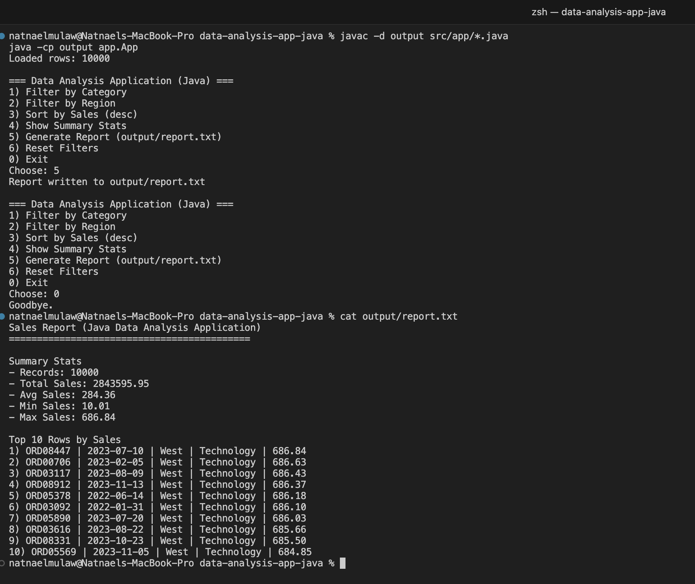

# Data Analysis Application (Java)

Console-based Java application that loads a CSV dataset (10,000+ records) and supports filtering, sorting, summary statistics, and report generation.

## Preview



## Features
- Load 10,000+ CSV records into Java objects (OOP)
- Filter by Category or Region
- Sort by Sales (descending)
- Compute summary statistics (count, sum, avg, min, max)
- Generate a report file at `output/report.txt`

## Dataset
The app generates a sample dataset automatically at:
`data/sales_10000.csv`

Columns: `OrderID, OrderDate, Region, Category, Sales`

## Run Instructions (Mac/Linux)
From the project root:

```bash
javac -d output src/app/*.java
java -cp output app.App
```

## Example Usage
- Enter `4` to view summary stats 
- Enter `1` then `Technology` to filter by category 
- Enter `5` to generate a report in `output/report.txt`
- Enter `6` to reset filters
- Enter `0` to exit the application 
